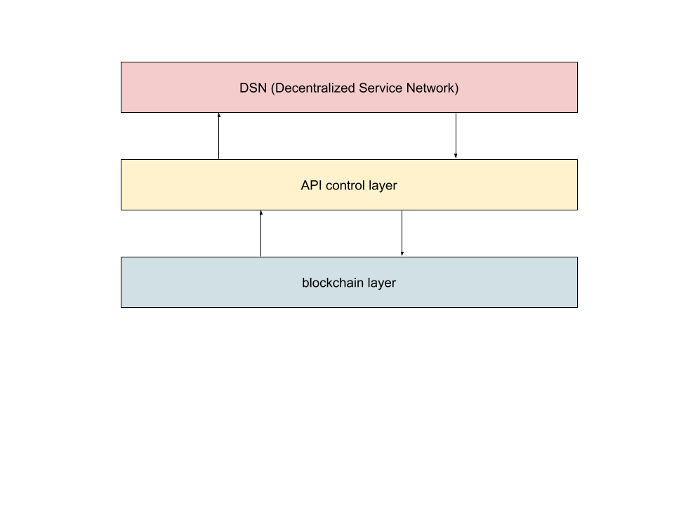
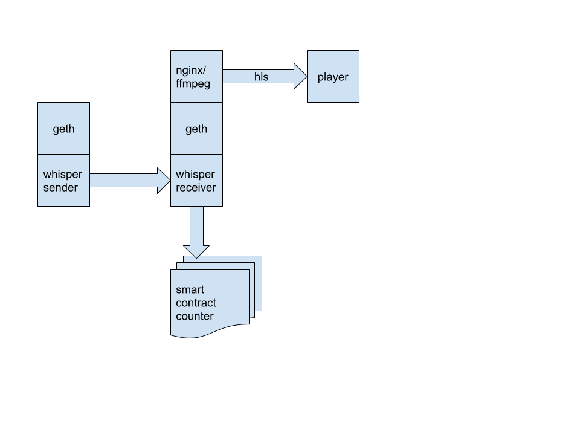
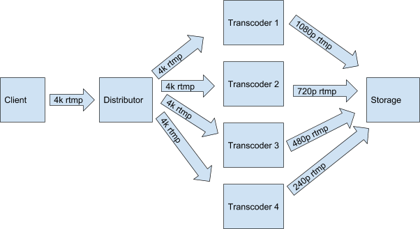
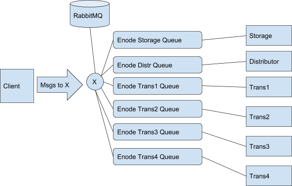

Some approaches to api control layer for DSN
============================================

**Main objecive**

- DSN - Decentralized Services Network (Transcoding or CDN or anti DDOS etc)
- choose suitable messaging protocol for control to DSN instances
- define criteria for such protocol

**Abstract Scheme**

Considered two protocols
- Ethereum wisper
- AMQP (RabbitMQ)

Each of them has its advantages and disadvantages.

**[Wisper protocol](https://github.com/ethereum/go-ethereum/wiki/Whisper)**

Native ethereum messaging protocol, part of official realise

*advantages*

1. decentrilized (not so important for poa network)
2. encrypted messages
3. part of eth api (not need additional software)

*limitations*

1. slow
2. poor and non stable api
3. sync keys security problem

**simple control scheme for videocoin network**

videocoin network consist of set of instances like nginx-rtmp/ffmpeg

**Process description**

- two nodes use geth with shh-api (whisper) on a vcnet2 network
- whisper sender sends messages to the vcnet2 network
- whisper receiver receives messages and turns them into system commands
- the start message starts streaming to ffmpeg / nginx and sends the transaction to the ethereum counter contract, increasing the counter by 1
- the stop message stops streaming to ffmpeg / nginx and sends the transaction to the ethereum counter contract, decreasing the counter by 1

**Creating a set of scripts for the ping - pong schema in whisper (Python)**

- t3_whisper_send.py PoC. Send message via whisper using symmetric crypto-key. Network vcnet2.

- t3_whisper_rec.py PoC. Receive message via whisper using symmetric crypto-key. Network vcnet2.

- t4_whisper_genpub.py 8502 8507 Generate t4.json for localy geth (RPC port range as sys.argv) 
- t4.json - cache of whisper node list .. generated with t4_whisper_genpub.py on each nodes and join.

- t4_whisper_send.py 8502 100 Send a 100 ping messages via 8502 RPC port. Send ping message 
to all-know (now from t4.json) node (using public-key of destination) and waiting pong back.

- t4_whisper_rec.py 8503 Where 8503 RPC port. listening and waiting for a ping message (to own public-key) and send pong back (to public-key of sender). For routing using t4.json table.

- Counter2.json abi of samart-contract using for count messages sended and received

**Installing and running a vcnet2 of 25 nodes (5 Whisper sender 20 Whisper receiver)**

- install_geth_5node.sh install script 5 eth-node vcnet2 per 1 vm (RPC ports: 8502 - 8507, com ports: 30313 - 30318, 30312 bootnodes port)
- start_vcnet2-[1-5].sh auto generated start script for 5x1 geth
- start_vcnet2-all.sh full start 5 geth in 1 vm
- stop_vcnet2_all.sh full stop 5 geth in 1 vm

**reports**

All reports about whisper jobs are in docs folder

**[AMQP](http://www.amqp.org/)**

Well known messaging protocol. We use [RabbitMQ](https://www.rabbitmq.com/) message broker for our purposes.

*advantages*

1. rich and flexible logic and functionality
2. fast
3. stable and scalable

*limitations*

1. centralized (not important for poa networks)
2. non encrypted messages

**simple control scheme for videocoin network**

**test** : Client, manual process creation, (1 distributor, 4 transcoders, 1 storage)

**Network layer**

**RabbitMQ layer**

- The client creates Exchange and a set of queues for all participants in the pipeline as well as a rule for routing messages in the queue.
- Each pipeline  participant connects to listen to their queue.
- The client sends the nginx config json configuration files for each of the participants in queue
message for storage
message to distributor
message N for transcoder N
- Each member receives a configuration message and applies it to their nginx.

