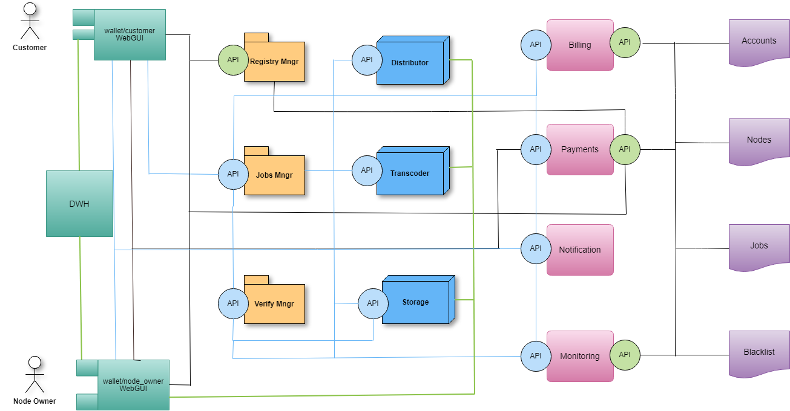
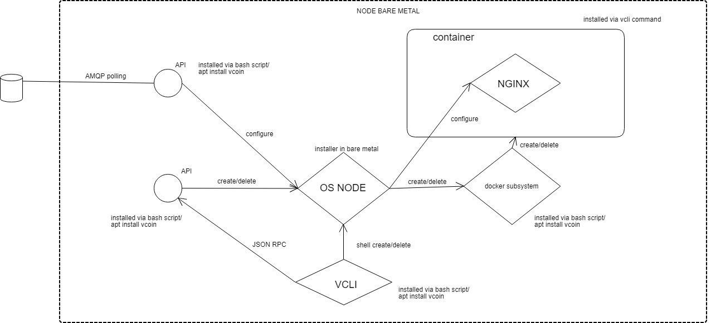

Some approaches to api control layer for DSN
============================================

**Main objecive**

- DSN - Decentralized Services Network (Transcoding or CDN or anti DDOS etc)
- choose suitable messaging protocol for control to DSN instances
- define criteria for such protocol

**Abstract Scheme**

Considered two protocols
- Ethereum wisper
- AMQP (RabbitMQ)

Each of them has its advantages and disadvantages.

**[Wisper protocol](https://github.com/ethereum/go-ethereum/wiki/Whisper)**

Native ethereum messaging protocol, part of official realise

*advantages*

1. decentrilized (not so important for poa network)
2. encrypted messages
3. part of eth api (not need additional software)

*limitations*

1. slow
2. poor and non stable api
3. sync keys security problem

**simple control scheme for videocoin network**

videocoin network consist of set of instances like nginx-rtmp/ffmpeg

**Process description**

- two nodes use geth with shh-api (whisper) on a vcnet2 network
- whisper sender sends messages to the vcnet2 network
- whisper receiver receives messages and turns them into system commands
- the start message starts streaming to ffmpeg / nginx and sends the transaction to the ethereum counter contract, increasing the counter by 1
- the stop message stops streaming to ffmpeg / nginx and sends the transaction to the ethereum counter contract, decreasing the counter by 1

**Creating a set of scripts for the ping - pong schema in whisper (Python)**

- t3_whisper_send.py PoC. Send message via whisper using symmetric crypto-key. Network vcnet2.

- t3_whisper_rec.py PoC. Receive message via whisper using symmetric crypto-key. Network vcnet2.

- t4_whisper_genpub.py 8502 8507 Generate t4.json for localy geth (RPC port range as sys.argv) 
- t4.json - cache of whisper node list .. generated with t4_whisper_genpub.py on each nodes and join.

- t4_whisper_send.py 8502 100 Send a 100 ping messages via 8502 RPC port. Send ping message 
to all-know (now from t4.json) node (using public-key of destination) and waiting pong back.

- t4_whisper_rec.py 8503 Where 8503 RPC port. listening and waiting for a ping message (to own public-key) and send pong back (to public-key of sender). For routing using t4.json table.

- Counter2.json abi of samart-contract using for count messages sended and received

**Installing and running a vcnet2 of 25 nodes (5 Whisper sender 20 Whisper receiver)**

- install_geth_5node.sh install script 5 eth-node vcnet2 per 1 vm (RPC ports: 8502 - 8507, com ports: 30313 - 30318, 30312 bootnodes port)
- start_vcnet2-[1-5].sh auto generated start script for 5x1 geth
- start_vcnet2-all.sh full start 5 geth in 1 vm
- stop_vcnet2_all.sh full stop 5 geth in 1 vm

**reports**

All reports about whisper jobs are in docs folder

**[AMQP](http://www.amqp.org/)**

Well known messaging protocol. We use [RabbitMQ](https://www.rabbitmq.com/) message broker for our purposes.

*advantages*

1. rich and flexible logic and functionality
2. fast
3. stable and scalable

*limitations*

1. centralized (not important for poa networks)
2. non encrypted messages

**simple control scheme for videocoin network**

**test** : Client, manual process creation, (1 distributor, 4 transcoders, 1 storage)

**Network layer**

**RabbitMQ layer**

- The client creates Exchange and a set of queues for all participants in the pipeline as well as a rule for routing messages in the queue.
- Each pipeline  participant connects to listen to their queue.
- The client sends the nginx config json configuration files for each of the participants in queue
  - message for storage
  - message to distributor
  - message N for transcoder N
- Each member receives a configuration message and applies it to their nginx.

**Results and issues**

- Messaging system work good
- rtmp delay between original stream and transcoded streams. Every time we have different amount of chunks on storage.
- original stream should have compatible format for hls
- bandwidth for distributor (50 in 250 out for 1 4k file)

**scrypts**
- hello_world_rec.py Description: PoC Receive a message from "test" queue. RabbitMQ server located in 10.163.0.3 with predefined credentials
- hello_world_send.py Description: PoC Send "Hello world" message to "test" queue with with routing-key = "test". RabbitMQ server located in 10.163.0.3 with predefined credentials

- t45_read.py node_id. Description: Reading a task via AMQP from query $node_id and reconfig nginx without docker. Using first version API. RabbitMQ server located in 10.168.0.3 with predefined credentials
- t45_send.py task.json Description: Sending a "pipeline" to a query "node_id" (for each node used own task, according to the description of pipeline). Using first version API. Pipeline in nested file task.json
- task.json File of task contains nested json array [{ "enode":"..00", "task":"command.json"},{}]

Full report is availible into the docs folder (RabbitMQ testing for videocoin network.docx)

**Proposals for microservices decomposition and API**

**General decomposition**

**Microservices:**

- Customer GUI
- DWH
- Node owner GUI
- Registry manager
- Jobs manager
- Verify manager
- Transcoding service
- Distributor service
- Storage service
- Billing
- Payments
- Notification
- Monitoring

**API’s:**

- Blue circle, blue line (AMQP transport, async usage, RabbitMQ)
- Green circle, black line (http json-rpc, sync usage, geth and web3py)
- Green line - software installation

**Smart Contracts (Ethereum POA)**

- Accounts
- Nodes
- Jobs
- Blacklist

Full API comands list is in docs folder (file: Microservices decomposition and API commands.docx)

**Using the docker of the nginx-rtmp container to install and configure the node (distributor, transcoder, storage)**

- Changing json format for reconfiguring nodes and dividing formats into public / private
- Preparing a docker image to work with this file (project in github + image in docker repo)
- Modification of the read.py receiver to work with the docker container
- Modification sender send.py for public configuration commands
- Real configuration tests

**Json format unification**

It is proposed to divide the json configuration file for nodes into 2 parts:
- The api private part contains the data associated with the installation of the docker container node
- The api public part is related to the direct configuration of the node for performing a specific task (node role). The process itself is opaque to the user and serves solely to simplify the understanding and configuration of the node file.

**Nginx-rtmp docker image**

To work with unified json, a nginx-rtmp fork was created with an empty default configuration for [nginx](https://github.com/77ph/docker-nginx-rtmp)

repo for this image is availible [here](https://hub.docker.com/r/77phnet/nginx-rtmp/)

**Tests**

A complete set of the tests to create, configure and delete instances (distributor, transcoder and storage) were performed using bash scrypt modules-test.sh

- 1 TEST - creating a distributor node

- 2 TEST - distributor node configuration for application job_id

- 3 TEST - create transcoder node

- 4 TEST - configuration transcoder node for application job_id

- 5 TEST - creating storage node

- 6 TEST - storage node configuration for application job_id

Configuration files, test results and issues were reperesented into docs folder in file: *Microservices decomposition and API commands.docx*

Naming logic for streams is described in file: *First steps for API.docx*

**Scrypts**

- prepare-container-node.sh Description: Called from t5_read.py. Script for pre-configure dockers subsystem and cleaning a dirs. Please, don't using as standalone script and don't move. 
- t5_read.py node_id Description: Reading a task via AMQP from query $node_id and create a docker container or reconfig nginx in container. Using "private" mode API. RabbitMQ server located in 10.168.0.2 with predefined credentials
- t5_send.py ../api/pipeline-with-commands.json or ../api/node_create-public.json  Description: Sending a "pipeline" to a query "node_id" (for each node used own task, according to the description of pipeline) or sending "task" "create node" to a query "node_id".

Auto-converted "public" API to "private" API. RabbitMQ server located in 10.168.0.2 with predefined credentials
- modules-test.sh Description: 6th tests: 
   - 1-2: Create a distributor + configure distributor via t5_send.py/t5_read. 
   - 3-4: Create a transcoder + configure transcoder via t5_send.py/t5_read.py.
   - 5-6: Create a storage + configure storage via t5_send.py/t5_read.py. All reference tasks and reference configure file located in "test" directory.

